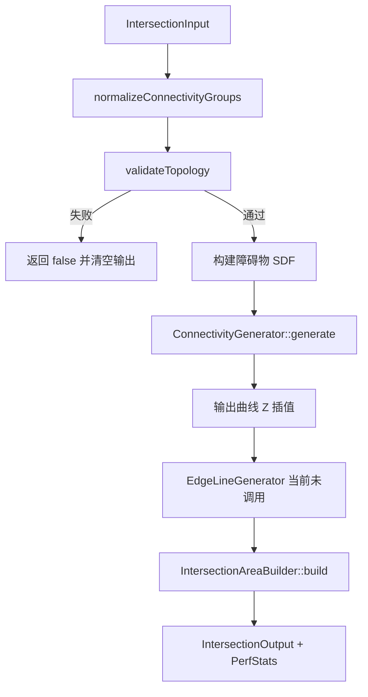
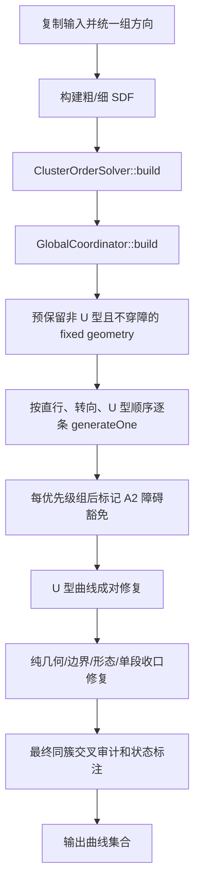
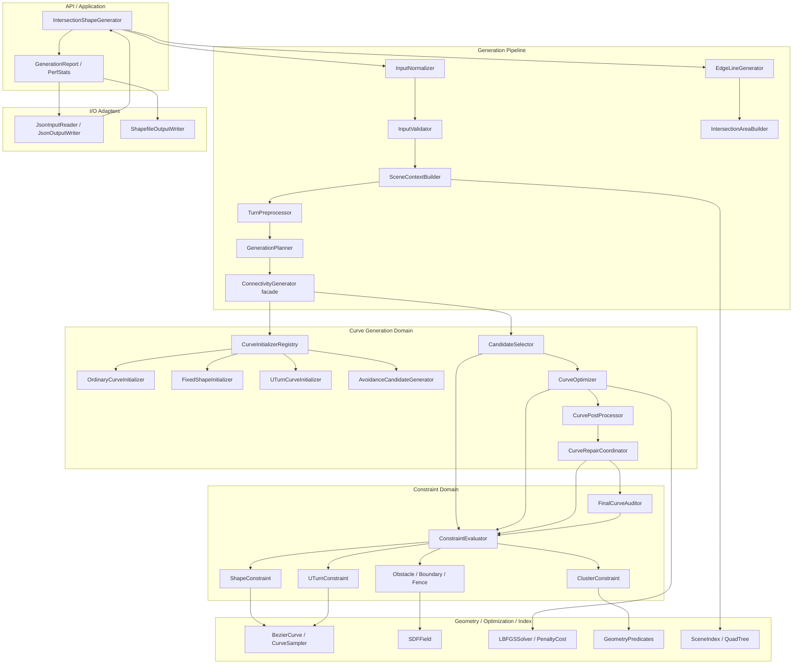
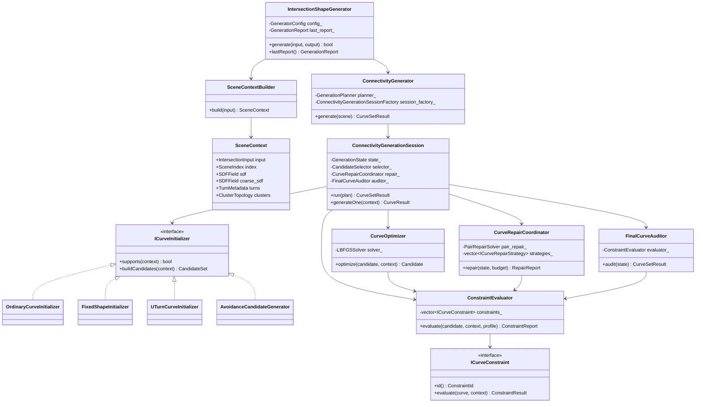
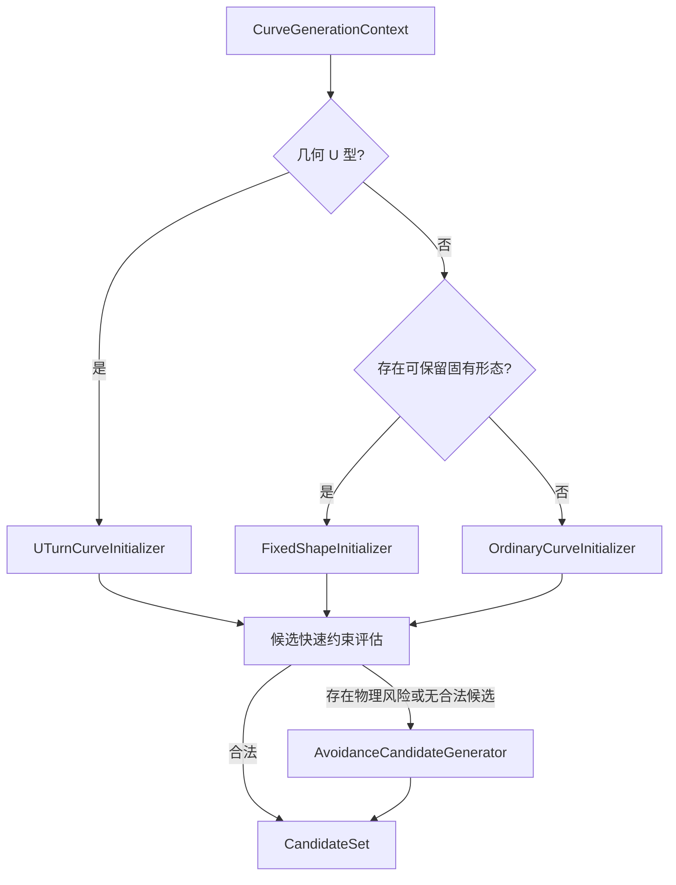
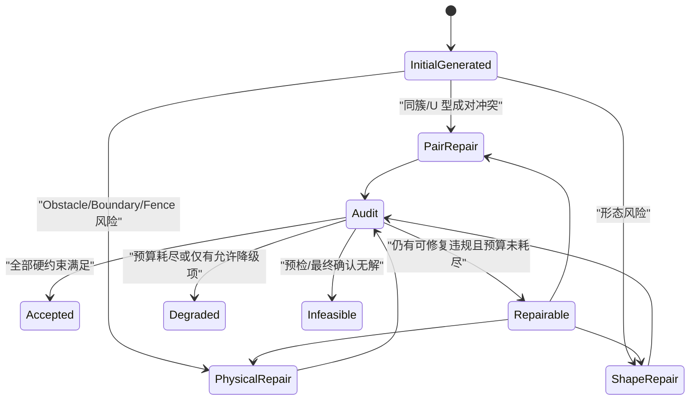
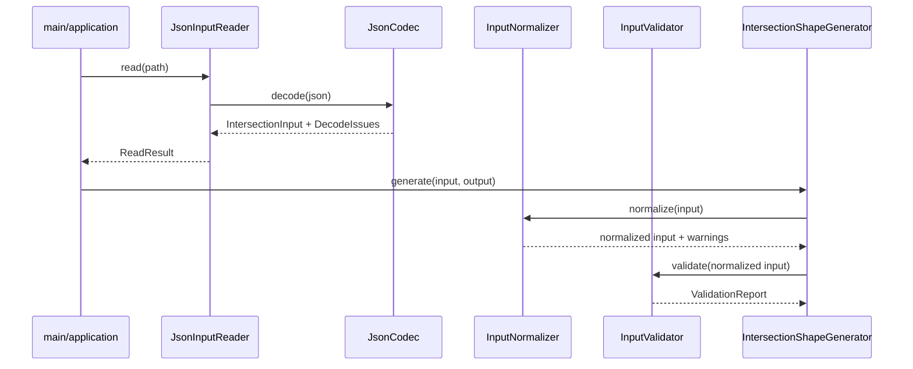
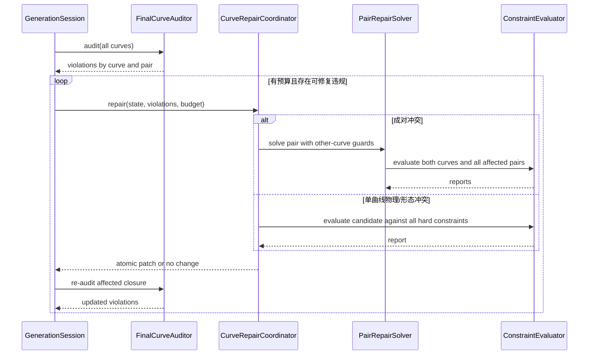
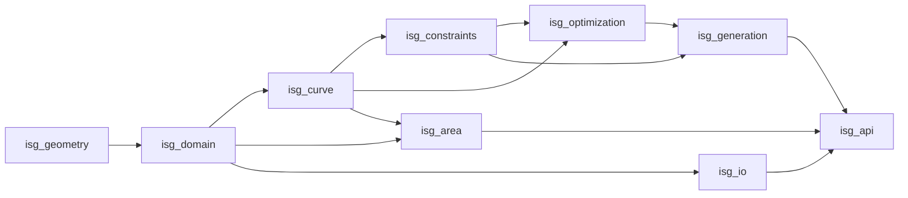

# 路口形态生成器 C++11 面向对象重构详细设计方案

> 文档状态：待评审
>
> 适用工程：`v2_intersection_shape_generator-cld-2`
>
> 设计目标：在不改变现有可观察功能、几何约束语义和性能边界的前提下，拆分超大文件、明确模块职责，并建立可独立编译、测试和演进的 C++11 架构。
>
> 本文只定义重构方案，不包含源码重构实施。

## 1. 结论与评审重点

当前工程已有完整的曲线数学、初始曲线、SDF、LBFGS、簇排序、无解预检、边界检查和场景回归基础，但核心业务仍高度集中：

| 文件 | 当前规模 | 主要问题 |
|---|---:|---|
| `src/generator/connectivity_generator.cpp` | 约 10,877 行 | 输入查询、方向预处理、排序、初始化、候选搜索、约束判断、修复、验证、输出高程等职责混杂 |
| `src/generator/polygon_builder.h` | 约 2,530 行 | 精细路口面算法全部位于头文件，编译依赖和实现细节泄漏严重 |
| `src/io/iodata_json.h` | 约 985 行 | JSON 编解码集中在头文件，任何数据结构变化都会扩大重编译范围 |
| `src/generator/edge_line_generator.h` | 约 573 行 | 实现位于头文件，且顶层生成流程当前未启用该模块 |

本次建议采用“薄编排器 + 显式上下文 + 策略化候选生成 + 统一约束审计 + 有界修复”的目标架构。第一阶段只做等价搬迁和接口收敛，不同时修改算法参数、约束阈值或候选优先级。

评审需要优先确认以下决策：

1. `ConnectivityGenerator` 保留为对外门面，但不再承载具体算法。
2. 所有候选统一经过同一个 `ConstraintEvaluator`，生成、优化、修复和最终审计不得各自维护不同判定逻辑。
3. 普通曲线、U 型调头、固有形态、物理避让分别使用独立初始化/候选策略。
4. 同簇约束按“关系建模、候选检测、成对修复、最终标注”四步拆分，避免与单条曲线生成互相递归。
5. 精细路口面和车道边线独立成 `.cpp` 模块；车道边线当前未接入的事实不在纯重构阶段偷偷改变。
6. 每个迁移阶段都必须通过跨约束回归和单路口运行时间门禁，不能以某个失败场景通过作为完成标准。

## 2. 重构范围

### 2.1 包含范围

- 输入输出与数据规范化。
- 基础几何、Bezier 曲线和采样。
- 车道/车道组方向统一与转向预处理。
- 全局生成顺序和簇排序。
- 普通曲线、固有形态、U 型调头和避让曲线初始化。
- 形态、G1、自交、曲率检测。
- U 型调头三段式、平齐、Crosswalk 和排序检测。
- 同簇非连接点不相交、贴合/重叠检测及豁免。
- Obstacle、Boundary、RoadEdge、Fence 避让。
- 候选筛选、LBFGS 局部优化、后处理和多轮修复。
- 连通车道边线与精细路口面生成。
- 结果状态、违规报告、性能统计和诊断日志。
- CMake 目标拆分、单元测试和跨约束回归测试。

### 2.2 非目标

- 第一阶段不替换 Eigen、nlohmann/json、Clipper 或 LBFGS。
- 不引入 C++14/17 特性；目标标准保持 C++11。
- 不在结构重构过程中调整现有业务阈值和经验参数。
- 不改变 JSON 字段、输出坐标格式和状态枚举的外部兼容性。
- 不把二维约束计算升级为三维约束；Z 仍只保留或插值。
- 不在未经专项评审时启用当前被注释的车道边线顶层调用。

## 3. 现有实现梳理

### 3.1 当前顶层流程



当前 `IntersectionShapeGenerator::generate()` 是稳定的外部入口，适合继续保留为应用层门面。内部问题主要来自 `ConnectivityGenerator` 既承担流程编排，又直接实现绝大部分策略和约束。

### 3.2 当前连通曲线流程



`generateOne()` 内部又混合了以下阶段：

1. 查询入口/出口点与方向，识别几何转向类型。
2. 计算 U 型平齐家族、人行横道清距和错开量。
3. 执行可行性预检并处理 Fence 放松。
4. 构造自然单段、Hermite、多段、U 型、Boundary 贴边或绕障候选。
5. 使用 SDF、Boundary、Fence、同簇兄弟曲线进行风险筛选。
6. 必要时执行 `PenaltyCost + LBFGS` 局部优化。
7. 自适应细分、弹性带平滑和 G1 恢复。
8. 多轮形态、Boundary、Obstacle 和同簇交叉修复。
9. 最终验证并写入 `CurveStatus`、`ViolationInfo` 和采样几何。

### 3.3 已确认的行为契约

这些契约在重构过程中必须保持，除非另开算法变更评审：

| 编号 | 行为契约 |
|---|---|
| B1 | 转向优先级主要按端点和切向的几何关系判断，不能完全信任输入 `turn_type`。 |
| B2 | 同组车道可配置为统一方向；默认使用 `GroupUnified`。 |
| B3 | 非 U 型固有形态原则上保留；穿障或阻断其他必要自然形态时允许重生成。 |
| B4 | 几何 U 型调头即使带固有形态，也必须按三段式规则重新生成。 |
| B5 | 无物理避让需求的普通直行/左转/右转优先且最终应使用单段三次 Bezier。 |
| B6 | 普通单段曲线内部控制点只能沿首尾原始方向轴移动，并受弦长和前向射线交点上限约束。 |
| B7 | 普通直行应近平直；普通左/右转应保持单拱、无明显曲率符号翻转和 S 形。 |
| B8 | U 型调头必须为“首直 + 单段中弧 + 尾直”三段式；无 Crosswalk 时首尾至少向路口内延伸 2m。 |
| B9 | 有 Crosswalk 时 U 型首尾直行段必须完全跨过相关人行横道面，中弧不得侵入该面。 |
| B10 | 同一 U 型传递连通分量共享轴向平齐站位；不能由单条曲线独自继续前推。 |
| B11 | 同 U 型家族需按半径/簇序形成嵌套，并使用小量相向错开防止共享直行段贴合。 |
| B12 | 同簇曲线除真实连接端点外不得交叉、贴合或重叠。结构性必交叉可豁免；障碍物附近可标记 A2 软化。 |
| B13 | 曲线不得穿越 Obstacle；`mode=2` 还需要额外障碍物清距。 |
| B14 | 曲线不得在非端点穿越或贴合 Boundary/RoadEdge；RoadEdge 还包含中心侧越界判断，`mode=2` 要求非端点净距。 |
| B15 | 曲线应位于有效粗糙路口面 Fence 内；检测到夹断时只允许有界放松并记录放松量。 |
| B16 | 普通曲线需保持端点 G1 且不得自交；U 型端点 G1 按现有业务特殊规则处理。 |
| B17 | 平面约束仅使用 XY；输出 Z 对非固有曲线按首尾端点高程沿弧长插值。 |
| B18 | 最终状态和违规信息必须由最终几何重新审计，不能沿用中间候选的过期判断。 |

### 3.4 当前结构风险

1. **职责边界缺失**：同一静态函数可能同时做候选构造、业务判定和修复选择，无法单测其中任一环节。
2. **判定重复**：Obstacle、Boundary、同簇相交、形态判断在生成、修复和最终验证中存在多套入口，容易出现“候选认为合法、最终审计认为非法”。
3. **隐式共享状态**：`cluster_solver_`、`solver_`、局部 `done/results`、豁免集合和风险集合共同影响结果，依赖顺序不清晰。
4. **数据查询低效**：`IntersectionInput::findLane/findGroup/findEdge` 为线性扫描，且实现落在 `connectivity_generator.cpp`，类型层反向依赖生成器实现。
5. **头文件过重**：路口面、车道边线和 JSON 实现进入所有包含它们的翻译单元，影响编译时间和封装。
6. **错误处理不足**：顶层使用 `catch (...)` 且不保留异常原因；调用方只能得到 `false`。
7. **诊断耦合**：环境变量读取和 `fprintf/std::cout` 分布于算法内部，不利于测试和库集成。
8. **功能接入不一致**：`EdgeLineGenerator` 存在实现，但顶层调用被注释；`GlobalCoordinator::addSoftObstacles()` 当前为空实现。
9. **单文件编译成本高**：任何局部修改都触发超大翻译单元重新编译，且静态函数无法复用或隔离测试。

### 3.5 现有代码到目标模块的迁移映射

下表行号基于本文评审时的源码，仅用于定位，实施时以函数名和测试行为为准：

| 当前位置 | 当前职责 | 目标模块 |
|---|---|---|
| `connectivity_generator.cpp:79-136` | `IntersectionInput` 查询、入口/出口端点方向 | `domain/scene_view.cpp` |
| `connectivity_generator.cpp:137-409` | 车道方向采样、组统一方向、输入变换 | `preprocessing/turn_preprocessor.cpp` |
| `connectivity_generator.cpp:410-534` | 几何转向优先级、全局生成顺序 | `ordering/generation_planner.cpp` |
| `connectivity_generator.cpp:553-690` | 兄弟曲线构造和初始侧向偏移 | `generation/connectivity_generation_session.cpp`、`constraints/cluster_constraint.cpp` |
| `connectivity_generator.cpp:691-758` | 自适应细分、优化和平滑后处理 | `curve/curve_post_processor.cpp` |
| `connectivity_generator.cpp:769-852` | 单曲线最终验证和状态设置 | `generation/final_curve_auditor.cpp` |
| `connectivity_generator.cpp:853-1432` | 结果索引、固有形态转换、Boundary 附着段 | `domain/scene_index.cpp`、`initialization/fixed_shape_initializer.cpp`、`constraints/boundary_constraint.cpp` |
| `connectivity_generator.cpp:1433-2129` | 曲线采样、同簇交叉/贴合、豁免和标注 | `constraints/cluster_constraint.cpp`、`generation/final_curve_auditor.cpp` |
| `connectivity_generator.cpp:2133-2665` | Obstacle、Boundary、RoadEdge、Fence、形态和输出高程辅助 | 对应各约束模块、`io/elevation_interpolator.cpp` |
| `connectivity_generator.cpp:2666-3897` | 统一风险评估、自然单段和 Boundary 安全候选 | `constraints/constraint_evaluator.cpp`、`initialization/ordinary_curve_initializer.cpp`、`initialization/avoidance_candidate_generator.cpp` |
| `connectivity_generator.cpp:3898-5272` | 冲突集合、纯几何拓扑/形态/单段修复、U 型家族信息 | `generation/curve_repair_coordinator.cpp`、`generation/pair_repair_solver.cpp`、`preprocessing/uturn_family_builder.cpp` |
| `connectivity_generator.cpp:5273-6864` | Waypoint 绕障、三段式 U 型构造、Crosswalk、U 型多约束搜索 | `initialization/avoidance_candidate_generator.cpp`、`initialization/uturn_curve_initializer.cpp`、`constraints/uturn_constraint.cpp` |
| `connectivity_generator.cpp:6865-7788` | `generateOne()` 全流程 | `generation/connectivity_generation_session.cpp` |
| `connectivity_generator.cpp:7790-10877` | 全局生成、U 型成对修复、收口修复和最终标注 | `generation/connectivity_generator.cpp`、`generation/pair_repair_solver.cpp`、`generation/final_curve_auditor.cpp` |
| `intersection_shape_generator.cpp` | 规范化、校验、SDF、曲线/边线/路口面调度、异常处理 | `api/intersection_shape_generator.cpp` 与 `preprocessing`/`io` 子模块 |
| `types.h` | 几何类型、DTO、生成结果、配置混合 | `domain/geometry_types.h`、`domain/intersection_types.h`、`domain/generation_types.h` |
| `polygon_builder.h` | 精细路口面完整实现 | `area/` 下的来源收集、边界链、拼环和修复模块 |
| `edge_line_generator.h` | 连通车道边线完整实现 | `edge/edge_line_generator.cpp` 及偏移/共享解析组件 |
| `iodata_json.h` | 所有 JSON 编解码 | `io/json_codec.cpp`，头文件仅保留 API |
| `boundary_safety.h`、`fence_check.h` | Boundary/RoadEdge/Fence 检测 | `constraints/boundary_constraint.cpp`、`constraints/fence_constraint.cpp` 与基础几何谓词 |

迁移时以“整组函数 + 对应测试”作为最小搬迁单元，避免只移动入口函数而把关键静态辅助留在原文件，形成新的跨文件隐式耦合。

## 4. 目标架构

### 4.1 分层架构图



### 4.2 依赖规则

依赖只能自上而下：

1. `application` 可依赖 `generation`、`area`、`edge`、`io` 接口。
2. `generation` 可依赖 `curve`、`constraints`、`optimizer` 和只读 `domain`。
3. `constraints` 可依赖 `curve`、`geometry`、`spatial`，不得依赖生成器。
4. `curve` 不得依赖业务生成器；Bezier 数学只依赖基础几何类型。
5. `io` 负责 DTO 与领域对象转换，不让 JSON 类型进入算法层。
6. `domain` 不依赖任何生成模块；查询索引由独立 `SceneIndex` 提供。
7. 所有模块不得通过包含其他模块的 `.cpp` 或头文件静态实现进行隐式复用。

### 4.3 目标目录

```text
src/
├── api/
│   ├── intersection_shape_generator.h
│   └── intersection_shape_generator.cpp
├── domain/
│   ├── geometry_types.h
│   ├── intersection_types.h
│   ├── generation_types.h
│   ├── scene_view.h
│   ├── scene_view.cpp
│   ├── scene_index.h
│   └── scene_index.cpp
├── io/
│   ├── json_codec.h
│   ├── json_codec.cpp
│   ├── elevation_interpolator.h
│   ├── elevation_interpolator.cpp
│   ├── shapefile_writer.h
│   └── shapefile_writer.cpp
├── preprocessing/
│   ├── input_normalizer.h
│   ├── input_normalizer.cpp
│   ├── turn_preprocessor.h
│   ├── turn_preprocessor.cpp
│   ├── uturn_family_builder.h
│   └── uturn_family_builder.cpp
├── ordering/
│   ├── cluster_order_solver.h
│   ├── cluster_order_solver.cpp
│   ├── generation_planner.h
│   └── generation_planner.cpp
├── curve/
│   ├── bezier.h
│   ├── bezier.cpp
│   ├── curve_sampler.h
│   ├── curve_sampler.cpp
│   ├── curve_metrics.h
│   ├── curve_metrics.cpp
│   ├── curve_post_processor.h
│   └── curve_post_processor.cpp
├── initialization/
│   ├── curve_initializer.h
│   ├── ordinary_curve_initializer.cpp
│   ├── fixed_shape_initializer.cpp
│   ├── uturn_curve_initializer.cpp
│   └── avoidance_candidate_generator.cpp
├── constraints/
│   ├── constraint.h
│   ├── constraint_evaluator.h
│   ├── constraint_evaluator.cpp
│   ├── shape_constraint.cpp
│   ├── uturn_constraint.cpp
│   ├── cluster_constraint.cpp
│   ├── obstacle_constraint.cpp
│   ├── boundary_constraint.cpp
│   ├── fence_constraint.cpp
│   └── feasibility_checker.cpp
├── optimization/
│   ├── curve_optimizer.h
│   ├── curve_optimizer.cpp
│   ├── penalty_cost.cpp
│   ├── lbfgs_solver.cpp
│   └── sdf_field.cpp
├── generation/
│   ├── connectivity_generator.h
│   ├── connectivity_generator.cpp
│   ├── connectivity_generation_session.h
│   ├── connectivity_generation_session.cpp
│   ├── candidate_selector.cpp
│   ├── curve_repair_coordinator.cpp
│   ├── pair_repair_solver.cpp
│   └── final_curve_auditor.cpp
├── edge/
│   ├── edge_line_generator.h
│   └── edge_line_generator.cpp
├── area/
│   ├── intersection_area_builder.h
│   ├── intersection_area_builder.cpp
│   ├── boundary_chain_builder.cpp
│   └── polygon_repair.cpp
├── geometry/
│   ├── predicates.h
│   ├── predicates.cpp
│   ├── polyline_ops.h
│   └── polyline_ops.cpp
└── diagnostics/
    ├── generation_logger.h
    └── generation_trace.h
```

迁移期间保留旧包含路径的兼容头，最终再统一目录；不要求一次性移动所有公共头文件。

## 5. 核心类设计

### 5.1 总体类图



### 5.2 `SceneView` 与索引

`IntersectionInput` 继续作为兼容 DTO，不再自行承担线性查询实现。新增只读视图：

```cpp
class SceneView {
public:
    explicit SceneView(const IntersectionInput& input);

    const IntersectionInput& input() const;
    const Lane* lane(const LaneId& id) const;
    const LaneGroup* group(const LaneGroupId& id) const;
    const LaneEdge* edge(const LaneEdgeId& id) const;
    const Connectivity* connectivity(const ConnId& id) const;
    EndpointFrame entryFrame(const LaneId& id) const;
    EndpointFrame exitFrame(const LaneId& id) const;

private:
    const IntersectionInput* input_;
    std::unordered_map<LaneId, const Lane*> lanes_;
    std::unordered_map<LaneGroupId, const LaneGroup*> groups_;
    std::unordered_map<LaneEdgeId, const LaneEdge*> edges_;
    std::unordered_map<ConnId, const Connectivity*> connectivities_;
};
```

要求：构造后只读；所有指针生命周期由本次 `generate()` 内持有的规范化输入保证；找不到 ID 时返回空指针并由输入校验形成明确错误，禁止算法层悄悄使用虚构坐标回退。

### 5.3 生成上下文与状态

```cpp
struct CurveGenerationContext {
    const SceneContext* scene;
    const Connectivity* connectivity;
    EndpointFrame entry;
    EndpointFrame exit;
    GeometricTurn turn;
    std::vector<SiblingCurve> siblings;
    FixedShapePolicy fixed_shape_policy;
    UTurnFamilyInfo uturn_family;
    ConstraintProfile profile;
};

struct GenerationState {
    std::vector<ConnectivityCurve> results;
    std::unordered_map<ConnId, BezierCurve> accepted_curves;
    std::unordered_set<ConnId> preserved_fixed_ids;
    std::unordered_set<ConnId> physical_risk_ids;
    std::unordered_set<ConnId> boundary_repair_ids;
};
```

`CurveGenerationContext` 是单条曲线的只读输入；`GenerationState` 是一次路口生成的唯一可变状态。任何模块不得持有跨 `generate()` 调用的场景状态，从而保证可重入性和后续并发扩展空间。

### 5.4 候选模型

```cpp
enum class CandidateOrigin {
    FixedShape,
    NaturalSingleCubic,
    Hermite,
    SegmentedUTurn,
    BoundaryFit,
    ObstacleBypass,
    Optimized,
    Repaired,
    Fallback
};

struct CurveCandidate {
    BezierCurve curve;
    CandidateOrigin origin;
    ConstraintReport report;
    double quality_score;
    bool preserves_fixed_shape;
};
```

候选对象必须携带来源和最新约束报告。候选每次几何变化后，旧报告自动失效并重新评估，禁止复用旧风险标志。

### 5.5 约束统一接口

```cpp
enum class ConstraintSeverity { Hard, Soft, Advisory };
enum class ConstraintState { Satisfied, Violated, Exempt, NotApplicable };

struct ConstraintResult {
    ConstraintId id;
    ConstraintSeverity severity;
    ConstraintState state;
    double violation;
    double penalty;
    std::vector<Vec2d> locations;
    std::string reason;
};

class ICurveConstraint {
public:
    virtual ~ICurveConstraint() {}
    virtual ConstraintId id() const = 0;
    virtual ConstraintResult evaluate(
        const BezierCurve& curve,
        const CurveGenerationContext& context) const = 0;
};
```

实现类及职责：

| 类 | 负责内容 | 不负责内容 |
|---|---|---|
| `EndpointG1Constraint` | 普通曲线首尾点和切向连续性 | 不修改控制点 |
| `SelfIntersectionConstraint` | 非端点自交 | 不判断同簇曲线 |
| `OrdinaryShapeConstraint` | 单段要求、控制点轴向范围、直行平直、转向单拱、曲率与弧弦比 | 不判断物理避让 |
| `UTurnShapeConstraint` | 三段式、首尾直段、中弧圆润度、平齐站位、家族错开和包络 | 不搜索候选 |
| `CrosswalkConstraint` | U 型 lead 跨越和中弧侵入 | 不负责普通 Crosswalk 代价 |
| `ClusterIntersectionConstraint` | 同簇非端点交叉、贴合、重叠、侧序及 A1/A2 豁免 | 不改变簇拓扑 |
| `ObstacleConstraint` | 硬多边形穿越和 SDF 清距 | 不负责 Boundary |
| `BoundaryConstraint` | Boundary 非端点相交/贴合、RoadEdge 中心侧和 mode=2 净距 | 不删除场景边界 |
| `FenceConstraint` | 粗糙路口面包含和溢出距离 | 不自行放松 Fence |
| `CurvatureConstraint` | 最大曲率限制 | 不评价业务转向类型 |

`ConstraintEvaluator` 根据阶段选择不同 `ConstraintProfile`，但底层检测器必须相同：

```cpp
struct ConstraintProfile {
    bool require_single_segment;
    bool enforce_fence;
    bool allow_structural_cross;
    bool allow_obstacle_cross_exemption;
    double obstacle_clearance;
    double road_edge_clearance;
    double cluster_endpoint_tolerance;
};
```

生成阶段可使用较低采样密度进行快速筛选，最终审计使用高密度/自适应采样；两者差异只能是精度和性能配置，不能是业务语义。

### 5.6 初始化策略

`CurveInitializerRegistry` 按明确优先级选择策略：



#### `OrdinaryCurveInitializer`

- 产生自然单段 G1 三次 Bezier。
- 按直行/左转/右转生成少量有界控制参数候选。
- 在无物理避让时不产生多段候选。
- 控制点始终满足轴向约束及弦长/射线交点上限。

#### `FixedShapeInitializer`

- 把输入折线转为 Bezier 表达，并保留原始输出几何和 Z。
- 只负责判断是否“有资格保留”；穿障、几何 U 型或明确阻断自然形态时交由策略层决定重生成。
- 固有形态与其他曲线的冲突必须进入同一簇约束审计。

#### `UTurnCurveInitializer`

- 预先计算 `UTurnFamilyInfo`，包括统一轴、平齐分量、唯一站位、Crosswalk lead 下限、半径顺序和首尾错开量。
- 只生成显式三段式候选。
- 候选枚举使用有界参数表和上限，保持性能可预测。
- 同一分量的数据一次计算、所有成员复用，避免每条曲线独立求站位导致不一致。

#### `AvoidanceCandidateGenerator`

- 仅在自然候选存在 Obstacle、Boundary 或 Fence 风险时启用。
- 生成 Boundary 贴边/脱离、障碍物绕行、Waypoint 等专用候选。
- 每个搜索维度和候选总数必须有硬上限。
- 避让候选仍需同时满足形态、同簇和 U 型约束，不能以物理安全为唯一录取条件。

### 5.7 簇排序与生成顺序

保留现有 `ClusterOrderSolver` 的业务能力，拆成两个只读结果：

```cpp
struct ClusterTopology {
    std::vector<CurvePair> pairs;
    std::unordered_map<LaneGroupId, std::vector<ConnId> > entry_order;
    std::unordered_map<LaneGroupId, std::vector<ConnId> > exit_order;
    // pair 索引、rank、参考法向和豁免信息
};

struct GenerationPlan {
    std::vector<GenerationBatch> batches;
};
```

`ClusterOrderSolver` 只建立拓扑和配对，不参与曲线生成；`GenerationPlanner` 使用几何转向、簇 rank 和 U 型半径生成计划：

- 优先级 0：直行。
- 优先级 1：左/右转。
- 优先级 2：U 型调头。
- 同优先级内保留现有由内向外规则。
- 同入口 U 型家族按半径由小到大生成，使外层曲线可参考内层兄弟。

障碍物 A2 豁免属于运行时拓扑状态，存入 `GenerationState` 的 `ClusterExemptionState`，不修改静态 `ClusterTopology`。

### 5.8 优化与后处理

`CurveOptimizer` 是 `PenaltyCost` 和 `LBFGSSolver` 的适配层：

```cpp
class CurveOptimizer {
public:
    CurveCandidate optimize(
        const CurveCandidate& initial,
        const CurveGenerationContext& context,
        const OptimizationBudget& budget) const;
};
```

规则：

1. 只优化需要局部修正的候选；无风险自然曲线直接通过。
2. 优化变量映射、G1 投影和代价权重封装在优化模块。
3. 优化后立即执行完整约束评估；代价下降不等于业务合法。
4. 多段曲线和单段曲线使用明确参数模式，禁止通过布尔组合在外部隐式切换。
5. `CurvePostProcessor` 负责自适应细分、弹性带平滑、端点恢复和最终 G1 投影；每个操作后重新审计硬约束。

### 5.9 修复协调器

修复不再散布在 `generate()` 和 `generateOne()` 中，而由 `CurveRepairCoordinator` 统一组织：



修复优先级：

1. 固有形态保留决策和不可行性确认。
2. Obstacle、Boundary/RoadEdge、Fence 物理硬约束。
3. U 型三段式、Crosswalk 和家族平齐。
4. 同簇禁止交叉/贴合以及退出侧排序。
5. 普通曲线单段、单拱和平直性恢复。
6. 曲率和紧凑度优化。

这里的优先级只决定“先处理什么”，不表示后处理可以破坏前面的约束。每次接受修复候选前必须检查全部硬约束，且不得新增原本不存在的受约束交叉。

### 5.10 最终审计与状态映射

`FinalCurveAuditor` 对所有最终曲线和所有相关配对进行全量重新评估：

| 状态 | 建议映射规则 |
|---|---|
| `OK` | 所有适用硬约束满足，无软豁免。 |
| `WarnA2` | 硬约束满足，但存在明确记录的障碍附近 A2 豁免或窄通道警告。 |
| `Degraded` | 产出可用几何，但存在不可消除的形态/簇/物理降级；必须带原因和位置。 |
| `Infeasible` | 无可用曲线，或预检/最终审计确认硬约束无解。 |

`ViolationInfo` 建议扩展为结构化问题列表，同时保留现有字段作为兼容投影。多个违规不得用后写入的字符串覆盖先前原因。

## 6. 多约束协同设计

### 6.1 约束交互矩阵

| 主变化 | 可能破坏的约束 | 接受候选前必须复检 |
|---|---|---|
| 为 Obstacle 横向绕行 | 同簇排序、Boundary、Fence、单拱形态 | Obstacle + Boundary + Fence + Cluster + Shape + SelfIntersection |
| 为 Boundary 贴边/脱离 | 端点 G1、RoadEdge 净距、形态、固有形态 | G1 + Boundary + Shape + FixedShape + Cluster |
| 同簇交叉修复 | Obstacle、Fence、普通单段、U 型平齐 | Cluster + Obstacle + Fence + Shape/UTurn + Crosswalk |
| U 型 lead 延长 | 家族统一站位、Boundary、Crosswalk、中弧曲率 | UTurnFamily + Boundary + Crosswalk + Curvature + Cluster |
| 弹性带平滑 | G1、单段表达、曲率符号、障碍净距 | G1 + Shape + Obstacle + Boundary + Fence |
| 自适应细分 | 段数契约、U 型三段式、采样输出 | Shape + UTurn + SelfIntersection |
| 固有形态重生成 | 形态保留、同簇兄弟布局 | FixedShapePolicy + 全部硬约束 |
| 成对 U 型修复 | 其他兄弟曲线交叉、出口侧排序 | Pair + AllOtherClusterPairs + UTurn + Physical |

### 6.2 统一录取规则

候选比较采用词典序而不是单一加权分数：

```text
1. 硬约束违规数量
2. 物理硬约束最大违规量
3. 新增同簇受约束交叉数量
4. U 型/普通形态硬违规数量
5. 固有形态保持等级
6. 软约束代价
7. 曲率、弧长和参数偏离等质量分
```

这样可以防止某个大权重“补偿”另一个不允许的硬违规。`PenaltyCost` 仍用于连续优化，但最终选择必须服从上述离散录取规则。

### 6.3 普通曲线与 U 型曲线分流

普通曲线和 U 型曲线共享基础几何、物理约束和最终审计，但不共享形态生成策略：

- 普通曲线的默认表达是单段三次 Bezier。
- U 型曲线的默认表达是固定语义的三段 Bezier。
- 普通曲线不能因同簇风险直接获得多段豁免。
- U 型的端点、平齐、Crosswalk 和家族排序规则由 `UTurnConstraint` 独立处理。
- 只有 `ConstraintEvaluator` 层统一二者的物理安全和相交检测。

### 6.4 同簇豁免模型

```cpp
enum class ClusterExemption {
    None,
    StructuralCross,
    ObstacleCross
};

struct PairConstraintContext {
    ConnId first;
    ConnId second;
    int expected_side;
    Vec2d reference_perpendicular;
    bool shared_endpoint;
    ClusterExemption exemption;
};
```

- `StructuralCross` 来自静态拓扑倒置，只豁免业务允许的穿越，不豁免贴合/重叠。
- `ObstacleCross` 必须由实际交点与 SDF 位置共同确认，且最终输出记录交点。
- 共享端点仅允许端点容差内接触，端点外共享 lead 仍是违规。
- U 型与左/右转的业务豁免必须显式编码，不能通过“没有 pair”间接推断。

## 7. 输入输出模块设计

### 7.1 输入流程



设计要求：

- `json_codec.cpp` 承担所有字段编解码，公共头只暴露函数声明。
- 缺失字段、重复 ID、无效枚举、空几何、悬空引用分别形成结构化问题。
- 兼容旧二维 JSON，Z 缺失时为 0。
- `InputNormalizer` 负责 group ID 补全和可配置方向统一，不修改调用方原对象。
- `InputValidator` 在生成前验证 ID 唯一性、引用完整性、端点几何、粗糙面简单性和参数范围。

### 7.2 输出流程

- `JsonOutputWriter` 只序列化领域输出，不执行几何计算。
- `ElevationInterpolator` 在曲线最终接受后统一处理 Z；固有形态按现有规则保留原 Z。
- `ShapefileOutputWriter` 与 JSON 输出共享同一 `IntersectionOutput`，不能自行修复几何。
- `GenerationReport` 同时包含输入问题、曲线问题、阶段耗时和候选/修复统计。

## 8. 精细路口面与车道边线设计

### 8.1 车道边线

`EdgeLineGenerator` 拆为：

- `CurveOffsetter`：中心线左右偏移。
- `SharedEdgeResolver`：相邻连通曲线共享边线识别和中线生成。
- `EdgeGeometryValidator`：边线自交、方向、端点和共享关系验证。
- `EdgeLineGenerator`：编排上述组件并生成 `ConnectivityLaneEdge`。

当前顶层调用被注释。纯结构迁移阶段保持输出为空；启用车道边线应作为独立功能变更，补充集成测试后再接入。

### 8.2 精细路口面

`IntersectionAreaBuilder` 拆为：

| 模块 | 职责 |
|---|---|
| `AreaSourceCollector` | 收集 Lane、LaneEdge、Boundary 三类独立构面源并保留来源元数据 |
| `GroupCutLineBuilder` | 按 mode 构造进入/退出组回缩或外扩截线 |
| `BoundaryChainBuilder` | 合并边界、求交、截取有效 RoadEdge 连续段 |
| `AreaRingAssembler` | 按路口中心和绕向拼接边界链与端侧连接段 |
| `PolygonRepair` | 吸附、去重、去共线、自交检测、绕向修复和闭合 |
| `AreaFallbackBuilder` | 道路边缘不足时使用端点或凸包回退，并记录降级原因 |

模式规则保持现状：

- `mode=1/3`：进入组向路口内回缩，退出组向路口外扩。
- `mode=2`：进入组和退出组均向路口外扩。
- Lane、LaneEdge、Boundary 属于不同来源类别，只允许类别内部去重。
- 输出允许内凹，但必须闭合、简单并满足配置绕向。
- Z 从来源三维折线插值或保留，不能在拼面阶段统一清零。

## 9. 关键时序

### 9.1 单条曲线生成时序

```mermaid
sequenceDiagram
    participant Session as ConnectivityGenerationSession
    participant Init as CurveInitializerRegistry
    participant Eval as ConstraintEvaluator
    participant Select as CandidateSelector
    participant Opt as CurveOptimizer
    participant Post as CurvePostProcessor
    participant State as GenerationState

    Session->>Init: buildCandidates(context)
    Init-->>Session: CandidateSet
    loop 每个候选
        Session->>Eval: evaluate(candidate, FastProfile)
        Eval-->>Session: ConstraintReport
    end
    Session->>Select: select(candidate set)
    Select-->>Session: best candidate
    alt 需要局部优化
        Session->>Opt: optimize(best, budget)
        Opt->>Eval: evaluate(optimized, FastProfile)
        Eval-->>Opt: report
        Opt-->>Session: optimized candidate
    end
    Session->>Post: process(candidate)
    Post->>Eval: evaluate(processed, AcceptanceProfile)
    Eval-->>Post: report
    Post-->>Session: accepted/degraded candidate
    Session->>State: commit curve and metadata
```

### 9.2 全局修复时序



成对修复应以原子方式提交两条曲线，不能先写入一条再让另一条基于半完成状态求解。

## 10. 配置与诊断

### 10.1 配置分组

将散落常量归入有边界的配置对象，但第一阶段默认值完全复制现状：

```cpp
struct GeneratorConfig {
    SDFConfig sdf;
    OptimizationConfig optimization;
    ShapeConstraintConfig shape;
    UTurnConfig uturn;
    ClusterConstraintConfig cluster;
    BoundaryConstraintConfig boundary;
    RepairBudget repair;
    SamplingConfig sampling;
    ConnectivityDirectionConfig direction;
};
```

每个配置字段需要单位、默认值、适用 mode 和合法范围。禁止使用无语义布尔参数串；例如 `tryBoundarySafeCandidate(..., false, ..., true)` 应替换为具名请求结构。

### 10.2 日志与追踪

```cpp
class IGenerationLogger {
public:
    virtual ~IGenerationLogger() {}
    virtual void log(const GenerationEvent& event) = 0;
};
```

- 默认使用空日志器，不直接输出到 `stdout/stderr`。
- 环境变量仅在应用边界解析为配置，算法模块不自行读取环境变量。
- `GenerationTrace` 可选记录候选来源、拒绝原因、约束耗时和修复动作，便于诊断但不影响算法结果。
- 顶层异常应转为结构化错误；仅在保证输出清理后返回 `false`。

## 11. 编译与链接设计

建议拆分静态库目标，缩小重编译范围：

```text
isg_geometry
isg_domain
isg_io
isg_curve
isg_constraints
isg_optimization
isg_generation
isg_area
isg_api
```

依赖方向示意：



要求：

- 所有公共头保持 C++11 可编译。
- 模板只用于真正需要泛型的基础算法，业务实现进入 `.cpp`。
- 第三方单头库放在 `third_party/` 或保留现状，但不与项目业务头混杂。
- CMake 为各模块明确列出源码，避免通配符导致无意编译。
- 可先保留总入口 `intersection_gen_lib`，内部链接拆分库，降低外部改造成本。

## 12. 测试与验收

### 12.1 测试分层

| 层级 | 重点 |
|---|---|
| 基础单元测试 | Bezier 求值/切向/曲率/拆分、折线站位、相交、点面关系、SDF 查询 |
| 模块单元测试 | 转向预处理、簇排序、每个约束、每个初始化策略、候选比较、路口面链拼接 |
| 组件测试 | 单条普通曲线、单条 U 型、固定形态、Boundary 贴边、障碍绕行、成对修复 |
| 跨约束回归 | 原失败场景与最可能互相影响的约束组合 |
| 端到端测试 | JSON 输入到 JSON/Shapefile 输出、状态和 Z 保留 |
| 性能测试 | 典型单路口、复杂多连接路口、候选上限和修复轮数 |

### 12.2 必须覆盖的跨约束矩阵

| 场景 | 必验约束 |
|---|---|
| 普通直行，无障碍 | 单段、平直、G1、自交、运行时间 |
| 普通左/右转，无障碍 | 单段、单拱、控制点轴向范围、曲率符号 |
| 普通转向 + Obstacle | 避障、Boundary、Fence、同簇、不得退化为 S 形 |
| 普通转向 + RoadEdge | 非端点不穿线、mode=2 净距、端点合法贴行、G1 |
| fixed geometry + 同簇兄弟 | 保形、障碍触发重生成条件、同簇交叉状态 |
| U 型无 Crosswalk | 三段式、首尾 lead >= 2m、中弧圆润、平齐 |
| U 型有 Crosswalk | 完整跨面、中弧不入面、Boundary、曲率 |
| 多条同入/同出 U 型 | 传递分量统一站位、半径嵌套、错开、出口侧序、无贴合 |
| U 型 + 普通转向 | 业务豁免准确，非豁免贴合仍能发现 |
| Obstacle + 同簇冲突 | A2 标记位置正确，不把普通交叉错误豁免 |
| Fence + Obstacle 夹断 | 无解预检、有限放松、状态和放松量 |
| 精细路口面 | mode 1/2/3、内凹、闭合、绕向、Z 保留、回退标记 |

### 12.3 现有测试映射

- `test_bezier`：曲线数学和控制点约束。
- `test_sdf`、`test_optimizer`：避障距离场和优化器。
- `test_cluster`：簇排序、配对和豁免。
- `test_infeasibility`：可达性、狭窄通道和夹断。
- `test_edge_line`：车道边线。
- `test_integration`、`test_scenarios`：综合生成。
- `test_intersection_input_regression`：真实输入和多约束回归，应作为迁移主门禁。
- `diag_*`：当前诊断程序；应逐步把稳定断言迁移为自动测试，诊断输出保留为辅助工具。

### 12.4 每阶段验收门禁

1. Debug 和 Release 均可完整编译。
2. 本阶段新增/修改的模块单元测试通过。
3. `test_intersection_input_regression` 中与该模块相关的所有标签通过。
4. 至少运行一组普通曲线、一组 U 型、一组 Boundary、一组 Obstacle、一组同簇组合场景。
5. 代表性单路口生成通常保持毫秒级，任何单路口必须低于 15 秒。
6. 输出曲线数量、ID、端点、状态和允许误差内的几何指标与基线一致。
7. 无新增编译警告；公共头自包含测试通过。

## 13. 分阶段迁移方案

### 阶段 0：冻结基线

- 记录所有现有测试结果、失败白名单、关键数据集输出摘要和运行时间。
- 为曲线输出建立几何指纹：段数、端点、弧长、最大曲率、包围盒、违规状态。
- 给当前未启用的车道边线和空 `addSoftObstacles()` 建立明确基线说明。
- 不修改算法。

完成标准：能判断后续变化是结构等价、预期修复还是意外回归。

### 阶段 1：基础类型、查询和几何提取

- 将 `IntersectionInput` 查询实现迁到 `scene_view.cpp`。
- 提取通用折线、相交、采样和高程插值函数。
- 消除 `fence_check.h` 中业务静态实现的重复副本。
- 增加基础函数单元测试。

完成标准：`connectivity_generator.cpp` 只调用新函数，算法流程和输出不变。

### 阶段 2：输入输出和精细路口面编译隔离

- 将 JSON/Shapefile 业务实现移入 `.cpp`。
- 把 `polygon_builder.h` 拆为声明、边界链、拼面和修复实现。
- 把 `edge_line_generator.h` 实现移入 `.cpp`，但保持顶层启用状态不变。

完成标准：头文件体积显著下降，包含这些头的最小客户端可独立编译。

### 阶段 3：预处理、排序和上下文

- 提取方向统一、几何转向识别、U 型家族预计算。
- 将 `GlobalCoordinator` 改为 `GenerationPlanner`。
- `ClusterOrderSolver::build()` 返回只读 `ClusterTopology`。
- 引入 `SceneContext`、`CurveGenerationContext` 和 `GenerationState`。

完成标准：生成顺序、pair 集合、rank、豁免和 U 型家族结果与基线一致。

### 阶段 4：约束检测统一

- 先提取纯检测函数，不改变调用顺序。
- 建立 `ConstraintEvaluator`，让候选筛选、修复和最终验证共用检测器。
- 引入结构化 `ConstraintReport`，兼容投影到现有 `ViolationInfo`。
- 将采样精度作为 profile 参数集中管理。

完成标准：同一曲线在相同 profile 下，各调用位置得到相同结果。

### 阶段 5：初始化与候选选择

- 提取普通、固有形态、U 型和避让策略。
- 用 `CurveCandidate` 替代局部 `BezierCurve + bool + score` 组合。
- 引入词典序 `CandidateSelector`。
- 保持候选参数、枚举顺序和数量上限不变。

完成标准：初始候选集合和最终被选候选与基线一致。

### 阶段 6：优化、后处理和单条生成会话

- 包装 `PenaltyCost/LBFGS` 为 `CurveOptimizer`。
- 提取 `CurvePostProcessor`。
- 将 `generateOne()` 收敛为清晰的流水线调用。

完成标准：`generateOne()` 只负责编排，不包含具体几何算法。

### 阶段 7：全局修复与最终审计

- 提取 U 型成对修复、普通拓扑修复、物理修复和形态恢复策略。
- 引入修复预算和影响闭包审计。
- 最终统一由 `FinalCurveAuditor` 写状态。

完成标准：`ConnectivityGenerator::generate()` 成为约 100 至 200 行的门面/会话启动代码，所有修复有独立测试。

### 阶段 8：清理兼容层

- 删除无调用旧静态函数和重复检查。
- 删除无效注释与过时的配置字段。
- 收紧 include，完成模块静态库拆分。
- 同步现有架构/功能/开发文档。
- 评估是否单独启用车道边线生成和实现软障碍物能力。

完成标准：无双轨实现、无死代码、无行为不明的占位接口。

## 14. 风险与控制

| 风险 | 影响 | 控制措施 |
|---|---|---|
| 几何浮点顺序变化 | 候选排序或边界判定发生细微变化 | 第一阶段保持循环、候选插入和比较顺序；使用稳定排序及显式 tie-break |
| 提取后采样密度不一致 | 生成合法但最终验证失败 | 统一 `SamplingConfig` 和检测器，只让 profile 改精度 |
| OOP 过度抽象 | 虚调用、分配和理解成本增加 | 只为真正可替换策略使用接口；值对象和无状态检测器优先 |
| 上下文复制过大 | 性能和内存退化 | `SceneContext` 只读引用；候选只复制必要曲线和小型报告 |
| 全局审计复杂度过高 | 大路口超时 | 使用 pair 索引、包围盒和四叉树；修复仅重审影响闭包 |
| U 型拆分改变家族行为 | 平齐、嵌套和错开回归 | 家族数据一次计算，组件级黄金测试覆盖传递分量 |
| 固有形态策略不一致 | 误改输入形态或阻断兄弟 | 把保形决策集中为 `FixedShapePolicy`，记录每次放弃原因 |
| 精细路口面拆分丢来源信息 | 拼面退化或 Z 丢失 | `BoundaryChain` 全程携带 source kind、ID、方向和源端点 |
| CMake 拆库出现循环依赖 | 无法独立编译 | 先画依赖图再迁移；领域层不依赖业务层；必要时提取小型公共值对象 |

## 15. 代码规范

- 类名 `PascalCase`，函数和变量沿用工程当前 `camelCase`，常量使用 `kName`。
- 一个类一个主要职责；实现超过约 500 行时优先检查是否仍混合职责，不机械按行数拆文件。
- 公共头只包含必要依赖，优先前置声明；不得 `using namespace`。
- 使用 `std::unique_ptr` 表达唯一所有权、`std::shared_ptr` 仅保留现有输出兼容需要。
- C++11 中用显式结果结构替代 `std::optional/std::variant`。
- 禁止裸 `new/delete`，禁止异常吞没，禁止算法深处直接输出日志。
- 所有距离参数注明单位为米，角度参数在名称中注明 `deg/rad`。
- 复杂几何函数注释说明业务不变量、容差语义和失败条件，不重复代码本身。
- 新增/修改/删除函数时同步头文件注释、模块文档和测试说明。

## 16. 评审清单

- [✓] 是否接受保持 `IntersectionShapeGenerator` 和 `ConnectivityGenerator` 为兼容门面？
- [✗] 是否接受先做等价拆分、后做算法改进的两阶段原则？
- [✓] 是否接受统一 `ConstraintEvaluator` 作为所有候选和最终审计的唯一业务判定入口？
- [✓] 是否接受普通曲线与 U 型调头使用独立初始化策略？
- [✗] 是否接受用词典序硬约束优先规则替代候选选择中的单一综合分数？
- [✓] 是否确认车道边线保持暂不启用，待独立功能评审？
- [✓] 是否确认 `addSoftObstacles()` 空实现不在纯重构阶段补功能？
- [✗] 是否接受按 8 个阶段逐步迁移，每阶段都可独立回退和验收？
- [✗] 是否需要保持现有头文件路径的源码级兼容，及兼容周期多长？
- [✓] 是否需要把结构化 `GenerationReport` 暴露给外部调用方，还是先仅内部使用？

## 17. 预期结果

完成重构后：

- `connectivity_generator.cpp` 从万行级算法集合变为薄门面和会话编排。
- 各约束有唯一实现、明确输入输出和独立测试。
- 普通曲线、U 型、固有形态和避让策略可以独立维护，不再通过大量静态函数和布尔参数交叉控制。
- 同簇、物理、形态和 U 型约束在任何几何变更后统一复检。
- 精细路口面、车道边线和 JSON 修改不再触发核心生成器的大范围重编译。
- 真实场景回归和性能门禁成为每个阶段的完成条件，而不是重构结束后的补充工作。

## 18. 最终物理布局说明

实施阶段在保持本方案职责边界和公共 API 的前提下，对过细的实现文件进一步按功能归并：

- `initialization` 的 fixed shape、普通曲线、U-turn、Waypoint 和注册表实现集中在 `curve_initializers.cpp`；原细分头继续作为兼容公共接口。
- `generation` 的候选选择与有界搜索集中在 `candidate_generation.cpp`，连续优化与后处理集中在 `curve_processing.cpp`，修复、影响闭包、原子提交和最终审计集中在 `repair_and_audit.cpp`；原细分头继续保留。
- JSON 公共声明位于 `io/json_codec.h`，实现位于 `io/json_codec.cpp`；`io/iodata_json.h` 仅保留兼容转发。
- `ConnectivityGenerator` 保持无状态薄门面，单路口可变状态和兼容算法后端位于 `ConnectivityGenerationSession`。

该归并只改变编译单元布局，不改变类职责、函数签名、候选枚举和评分顺序、约束阈值、JSON 字段或车道边线关闭状态。
